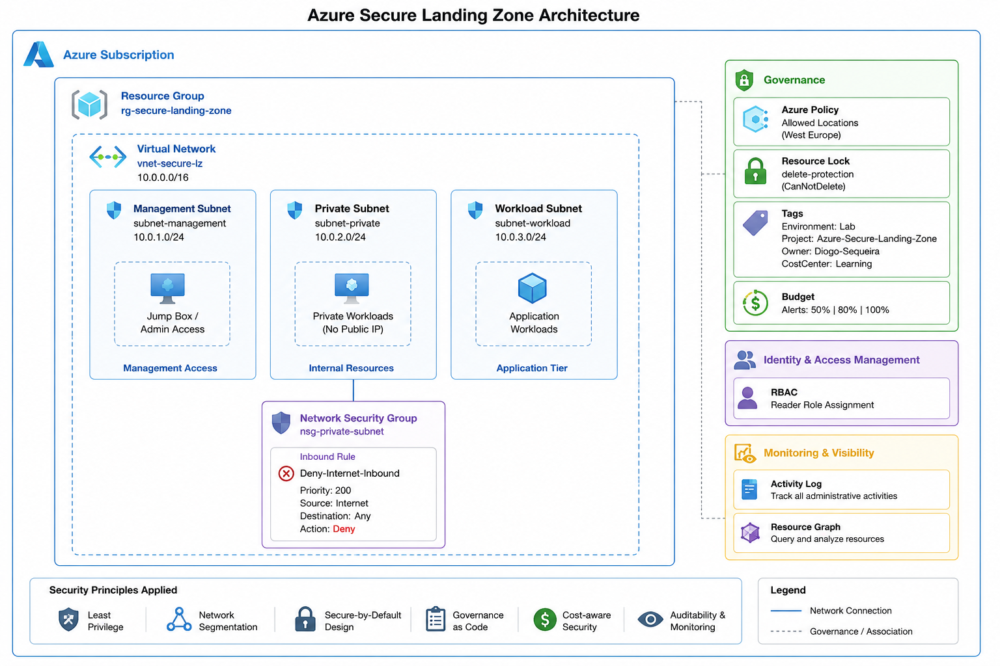

# Azure Secure Landing Zone


---

## Project Overview

This project demonstrates the design and implementation of a secure Azure Landing Zone following Microsoft Azure security, governance, and networking best practices.

The environment was built using a security-first approach focused on:

- Network Segmentation
- Least Privilege Access Control (RBAC)
- Network Security Groups (NSGs)
- Azure Governance Controls
- Cost Management
- Infrastructure as Code (Terraform)
- DevSecOps Validation

The project was implemented using both the Azure Portal and Terraform.

---

## Architecture



### Components

- Resource Group
- Virtual Network
- Management Subnet
- Private Subnet
- Workload Subnet
- Network Security Group
- Azure RBAC
- Azure Policy
- Resource Locks
- Cost Management Budget
- Terraform Infrastructure as Code
- GitHub Actions Validation Pipeline

---

## Azure Resources

| Resource Type | Name |
|--------------|------|
| Resource Group | `rg-secure-landing-zone` |
| Virtual Network | `vnet-secure-lz` |
| Management Subnet | `subnet-management` |
| Private Subnet | `subnet-private` |
| Workload Subnet | `subnet-workload` |
| Network Security Group | `nsg-private-subnet` |
| Resource Lock | `delete-protection` |
| Azure Policy | `Allowed Locations` |

---

## Network Design

| Component | Address Space |
|------------|---------------|
| Virtual Network | `10.0.0.0/16` |
| Management Subnet | `10.0.1.0/24` |
| Private Subnet | `10.0.2.0/24` |
| Workload Subnet | `10.0.3.0/24` |

### Network Segmentation

The virtual network was divided into dedicated subnets to isolate management, private, and workload resources.

This design follows the principle of reducing attack surface and limiting lateral movement.


## Security Controls

### Network Security Group

An NSG named `nsg-private-subnet` was associated with the private subnet.

### Security Rule

| Rule Name | Priority | Source | Destination | Action |
|------------|----------|----------|-------------|--------|
| Deny-Internet-Inbound | 200 | Internet | Any | Deny |

This rule blocks inbound traffic originating from the Internet.

---

### RBAC (Least Privilege)

Azure Role-Based Access Control was configured using the Reader role.

This implementation follows the Principle of Least Privilege by allowing visibility of resources without granting modification permissions.

---

## Governance & Compliance

### Azure Policy

An Azure Policy was assigned to restrict resource deployments to approved Azure regions.

Policy:

- Allowed Locations = West Europe

### Resource Lock

A Delete Lock was applied to the Resource Group:

```text
delete-protection
```

This prevents accidental deletion of critical resources.

### Resource Tags

Standardized tags were applied across resources:

| Tag | Value |
|------|--------|
| Environment | Lab |
| Project | Azure-Secure-Landing-Zone |
| Owner | Diogo-Sequeira |
| CostCenter | Learning |

---

## Cost Management

A monthly Azure Budget was configured to monitor spending and trigger alerts.

Configured thresholds:

- 50%
- 80%
- 100%

Email notifications are automatically sent when thresholds are reached.

### Cost Optimization Decisions

The following paid services were intentionally excluded:

- Azure Bastion
- Azure Firewall
- NAT Gateway
- VPN Gateway
- Application Gateway
- Microsoft Sentinel
- Defender for Cloud (Paid Plans)

This keeps the environment within Azure Free Tier limits.

---

## Infrastructure as Code (Terraform)

Terraform was used to reproduce the Azure environment as code.

Implemented resources:

- Resource Group
- Virtual Network
- Management Subnet
- Private Subnet
- Workload Subnet
- Network Security Group
- NSG Security Rules
- NSG Associations
- Resource Tags

Terraform files:

```text
terraform/
├── main.tf
├── variables.tf
├── outputs.tf
```

---

## DevSecOps Validation

GitHub Actions were implemented to automatically validate Terraform code.

### Implemented Controls

- Terraform Init
- Terraform Format Check
- Terraform Validate
- Checkov Security Scan

The Checkov security scanner helps identify potential cloud security misconfigurations before deployment.

---
## Terraform Module Roadmap

The Terraform structure is being prepared to evolve into reusable modules:

- `modules/networking` for VNet, subnets and NSGs
- `modules/governance` for policies, locks and tags

This improves maintainability and follows Infrastructure as Code best practices.
## Skills Demonstrated

### Azure

- Azure Resource Groups
- Azure Virtual Networks
- Azure Subnets
- Azure Network Security Groups
- Azure RBAC
- Azure Policy
- Azure Resource Locks
- Azure Cost Management

### Cloud Security

- Secure Landing Zone Design
- Network Segmentation
- Least Privilege
- Governance Controls
- Cost-Aware Security Design

### Infrastructure as Code

- Terraform
- AzureRM Provider
- Resource Dependencies
- Infrastructure Automation

### DevSecOps

- GitHub Actions
- Terraform Validation
- Security Scanning
- Checkov

### Documentation

- Technical Documentation
- Architecture Diagrams
- Security Decision Records

---

## Future Improvements

- Deploy a Private Ubuntu VM
- Implement Azure Key Vault
- Add Bastion Developer SKU
- Add Log Analytics Workspace
- Add NSG Flow Logs
- Create Custom Azure Policies
- Implement Terraform Modules
- Add Terraform Remote State
- Integrate Microsoft Defender for Cloud

---

## Author

**Diogo Sequeira**

Computer Engineering Student | Cloud Security Enthusiast

Focused on Azure Security, Cloud Governance, Infrastructure Security and DevSecOps.
