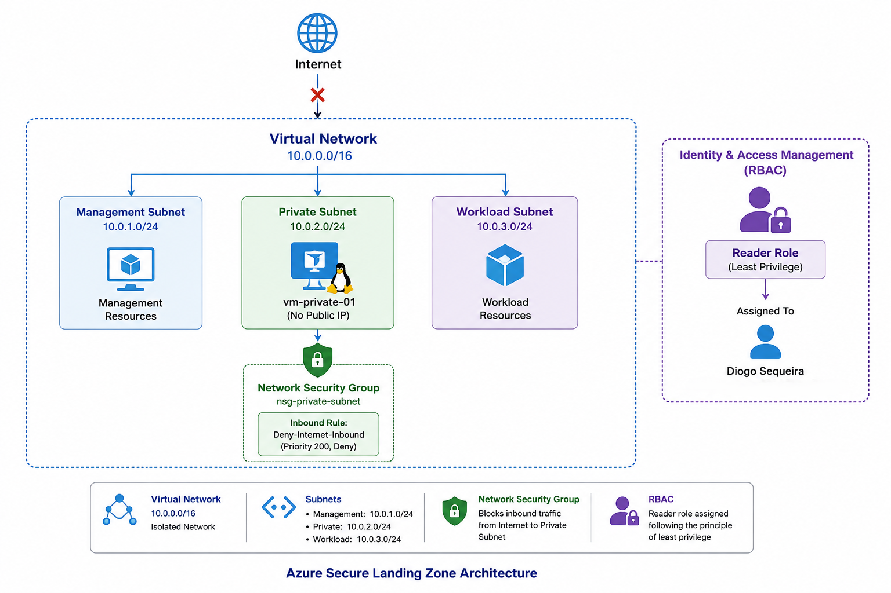

# Azure Secure Landing Zone


## Overview

This project demonstrates the design and implementation of a secure Azure Landing Zone following Microsoft cloud security and networking best practices.

The environment was built with a security-first approach focusing on:

- Network segmentation
- Least privilege access control (RBAC)
- Network Security Groups (NSGs)
- Cost optimization
- Infrastructure as Code (Terraform)

The project was implemented using both the Azure Portal and Terraform.

## Architecture


The landing zone includes:

- Resource Group
- Virtual Network
- Management Subnet
- Private Subnet
- Workload Subnet
- Network Security Group
- Inbound deny rule for Internet traffic
- RBAC Reader role assignment


## Network Design

| Component | Name | Address Space |
|---|---|---|
| Virtual Network | `vnet-secure-lz` | `10.0.0.0/16` |
| Management Subnet | `subnet-management` | `10.0.1.0/24` |
| Private Subnet | `subnet-private` | `10.0.2.0/24` |
| Workload Subnet | `subnet-workload` | `10.0.3.0/24` |

## Security Controls

## Infrastructure as Code (Terraform)

This project was also implemented using Terraform Infrastructure as Code (IaC).

The Terraform configuration recreates the Azure environment including:

- Resource Group
- Virtual Network
- Management Subnet
- Private Subnet
- Workload Subnet
- Network Security Group (NSG)
- Deny-Internet-Inbound Rule
- NSG Association with Private Subnet

The Terraform code can be found in:

```text
terraform/main.tf

### Network Segmentation

The virtual network was divided into multiple subnets to separate management, private and workload resources.

### Network Security Group

An NSG named `nsg-private-subnet` was associated with the private subnet.

The following inbound rule was created:

| Rule Name | Priority | Source | Destination | Action |
|---|---:|---|---|---|
| `Deny-Internet-Inbound` | `200` | Internet | Any | Deny |

### RBAC Least Privilege

Azure Role-Based Access Control was configured using the Reader role.

This allows visibility over resources without granting permissions to create, modify or delete Azure resources.

## Cost Control

This project was designed to avoid unnecessary costs.

The following paid services were intentionally avoided in the initial version:

- Azure Bastion
- Azure Firewall
- NAT Gateway
- VPN Gateway
- Application Gateway
- Microsoft Sentinel
- Defender for Cloud paid plans

## Skills Demonstrated

- Azure Portal
- Resource Groups
- Virtual Networks
- Subnet Design
- Network Security Groups
- RBAC
- Least Privilege
- Cloud Security Architecture
- Cost-aware Azure design

## Future Improvements

- Deploy a private Ubuntu VM without a public IP
- Add Azure Bastion Developer SKU if available
- Add Azure Key Vault
- Add Azure Policy
- Convert deployment to Terraform
- Add monitoring with Log Analytics


---

# 2. Adiciona uma secção de Skills

No final do README mete:

```markdown
## Skills Demonstrated

### Azure

- Azure Resource Groups
- Azure Virtual Networks
- Azure Subnets
- Azure Network Security Groups
- Azure RBAC

### Cloud Security

- Network Segmentation
- Least Privilege Access Control
- Inbound Traffic Restriction
- Secure Landing Zone Design

### Infrastructure as Code

- Terraform
- AzureRM Provider
- Resource Dependencies
- Network Security Automation

### Version Control

- Git
- GitHub
- Technical Documentation
